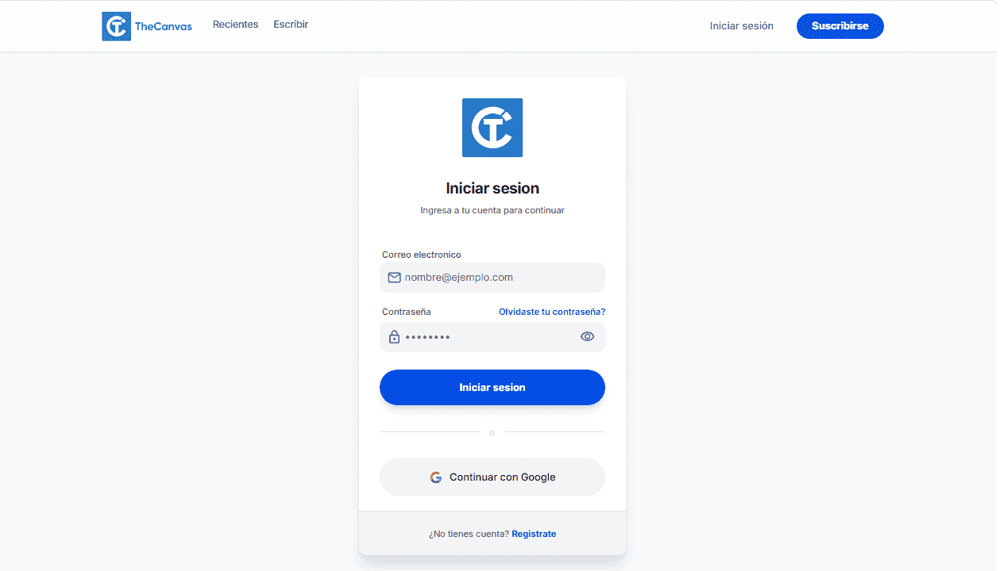
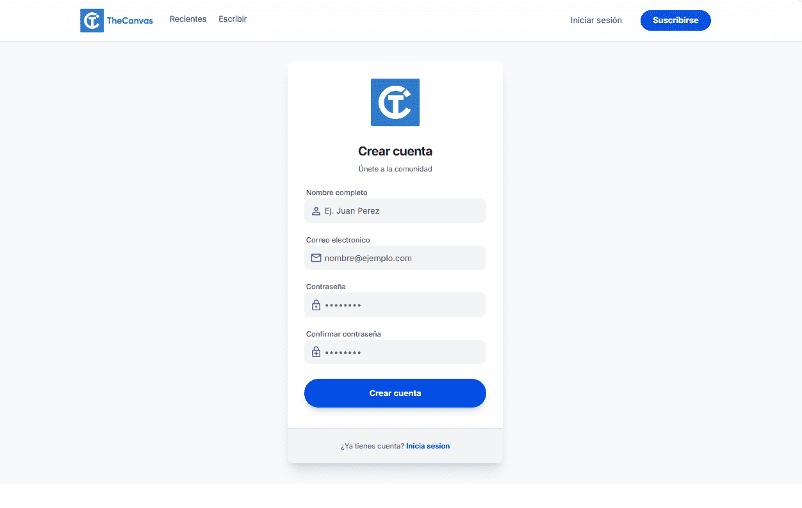
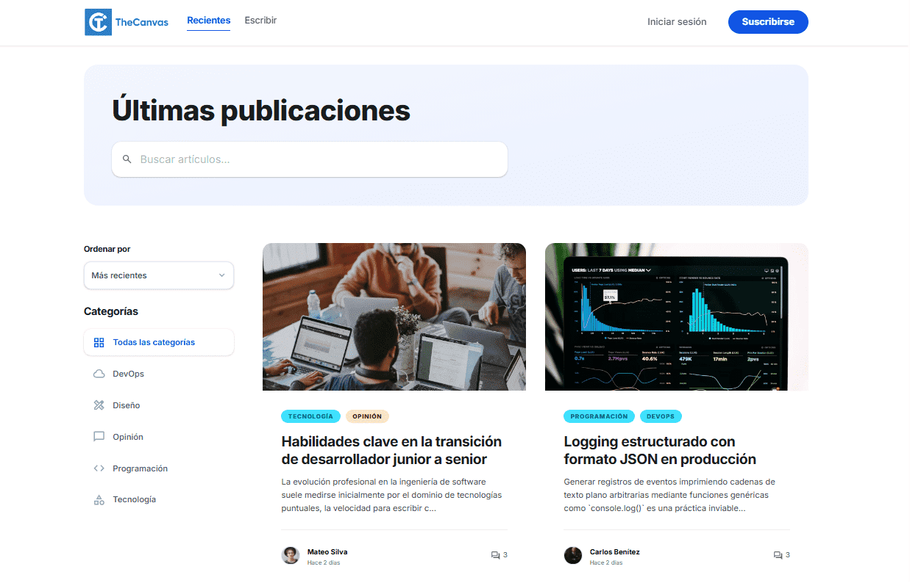
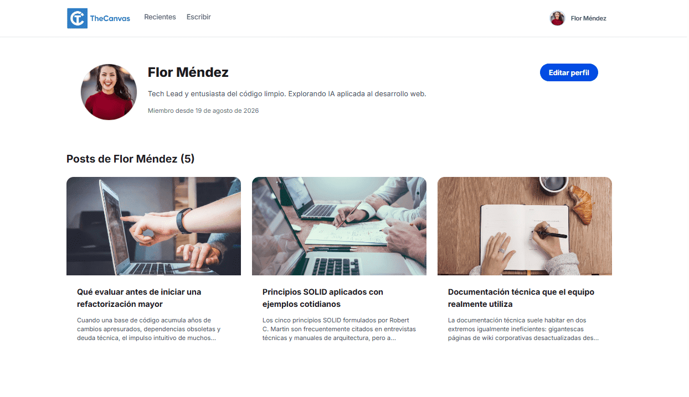
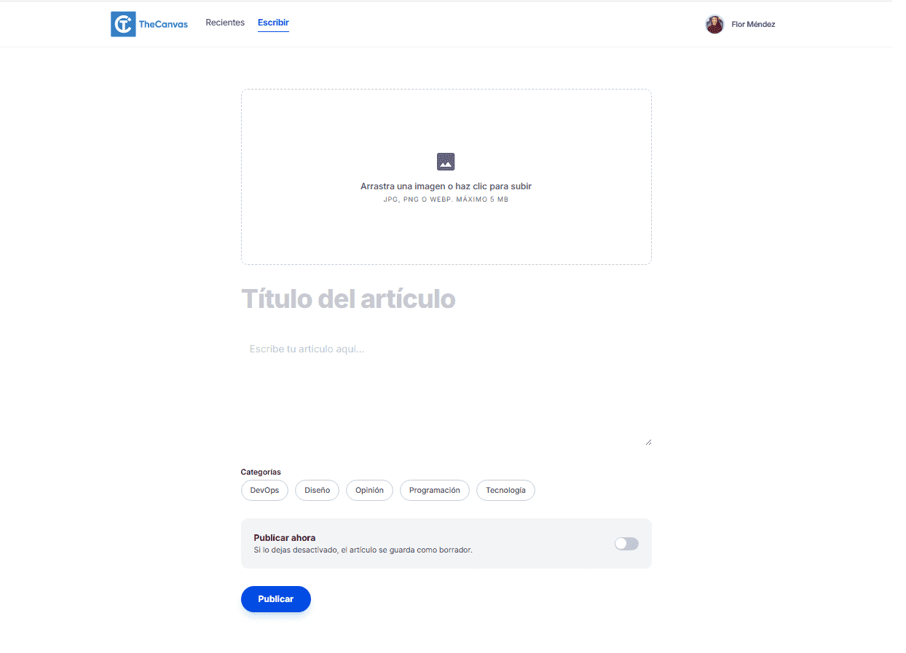
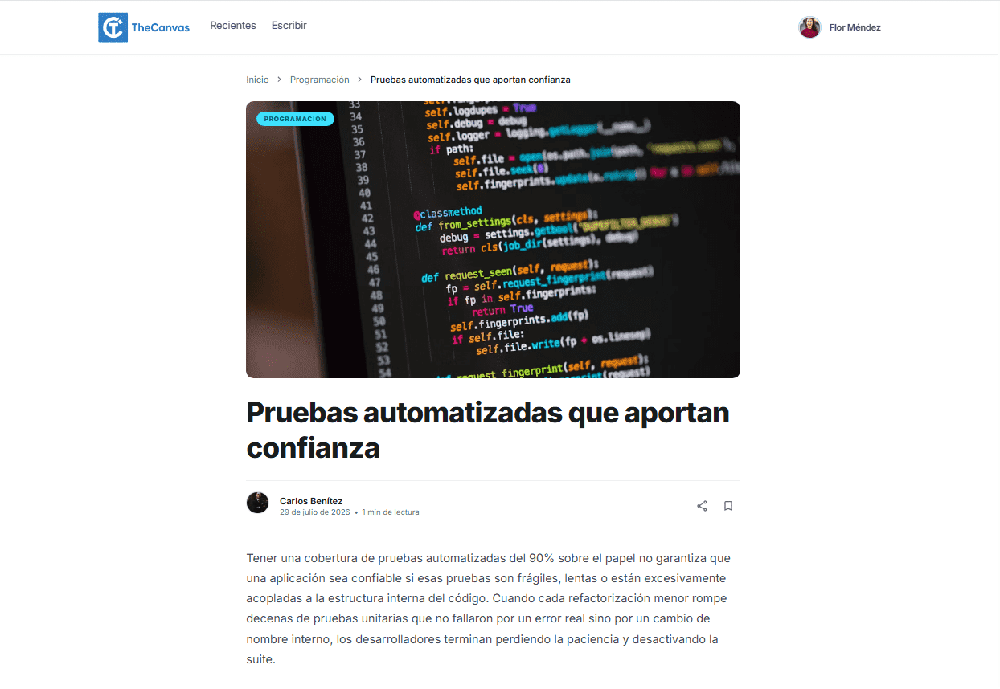
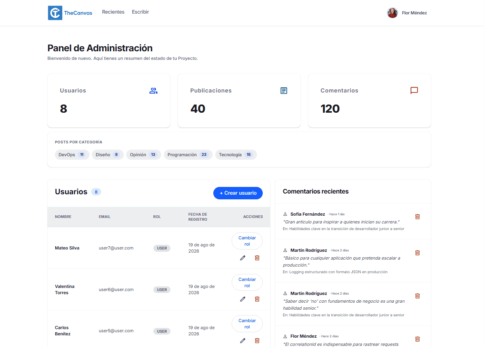

# FS-0008

Aplicación construida como parte del Amplix Acceleration Program (track JavaScript).

## Descripción

Aplicación de blog con sistema de comentarios y autenticación.
Los usuarios pueden registrarse, iniciar sesión y crear publicaciones, mientras que un rol de administrador cuenta con un panel dedicado para gestionar usuarios, posts y comentarios.

La aplicación diferencia dos roles:

- **Usuario regular**: se registra, inicia sesión, crea y edita sus propias publicaciones, y comenta en publicaciones existentes.
- **Administrador**: además de lo anterior, accede a un panel de administración con estadísticas, gestión de usuarios, moderación de posts y comentarios.

## Tech stack

- Backend: NodeJS, Express, PostgreSQL, Prisma ORM, JWT, bcrypt, Zod.
- Frontend: React, Tailwind CSS, React Router, Vite, React Hook Form + Zod, Axios.
- Infraestructura:
  - Docker / Docker Compose • PostgreSQL en desarrollo (opcional)
  - Vercel • deploy del frontend
  - Render • deploy del backend

## Estructura del proyecto

```txt
FS-0008/
├── backend/
├── docs/
├── frontend/
└── docker-compose.yml
```

## Screenshots

### Iniciar sesión


### Registrarse


### Inicio


### Perfil de usuario


### Crear publicación


### Detalle de publicación


### Panel de administración


## Instalación del proyecto

Para clonar el repositorio, levantar la base de datos, configurar las variables de entorno y correr el frontend y el backend, consultá la siguiente guía.

**[GUÍA DE INSTALACIÓN](/docs/onboarding/setup.md)**

## Documentación de la API

La documentación completa de los endpoints (rutas, parámetros, autenticación con JWT, ejemplos de request/response) está disponible en:

**[DOCUMENTACIÓN DE LA API](/docs/documentation-api/README.md)**

---

## URLs públicas

- 🌐 **Frontend:** [fs-0008.vercel.app](https://fs-0008.vercel.app/)
- ⚙️ **Backend:** [fs-0008.onrender.com](https://fs-0008.onrender.com/)